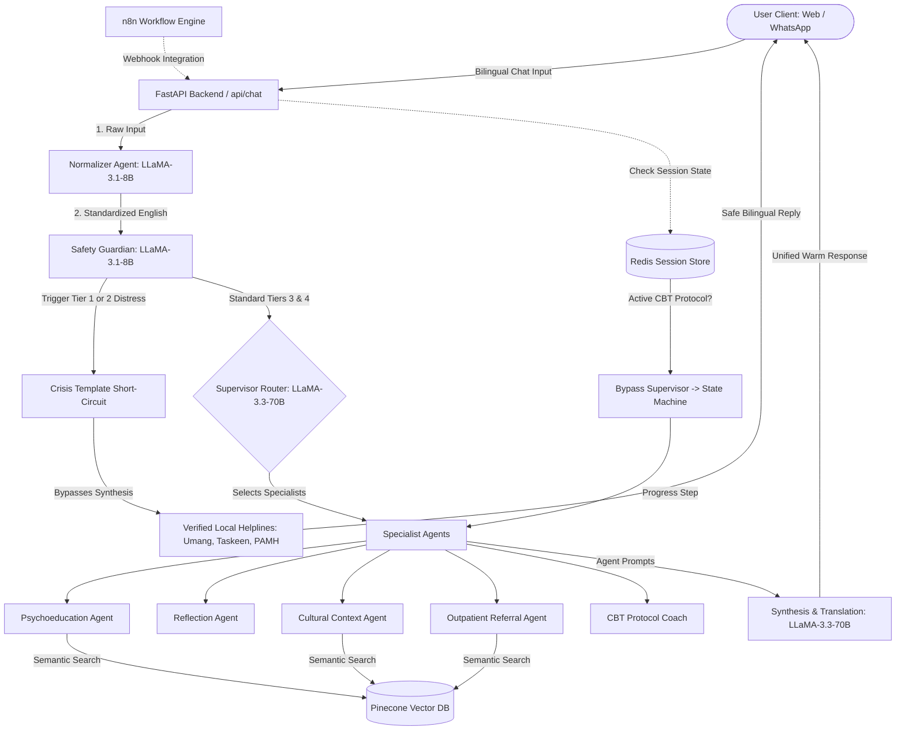

# Hamsafar: Culturally Contextualized Multi-Agent AI Mental Health Support System

**Hamsafar** (meaning *"companion"* or *"fellow traveler"* in Urdu) is a stateful, multi-agent AI counseling and triage platform specifically designed for the Pakistani demographic. It delivers empathetic, bilingual psychoeducation and Cognitive Behavioral Therapy (CBT) protocols in Roman Urdu, Urdu script, and English. 

The system incorporates a robust **Always-On Safety Guardian** to handle crisis intervention, an asymmetric risk assessment engine, and programmatic state machines to deliver structured mental health exercises while short-circuiting dangerous queries to verified local helplines (Umang, Taskeen, PAMH) with absolute reliability.

---

## 🚀 Key Features

*   **Decoupled Dual-LLM Architecture:** Uses **LLaMA-3.1-8B** for high-speed, cost-effective tasks (safety checking, text normalization, bilingual translation) and **LLaMA-3.3-70B** for advanced reasoning (supervisor routing, specialized CBT coaching, semantic synthesis).
*   **Always-On Safety Guardian (Triage Engine):** Programmatic 5-Tier risk classification. If self-harm or severe clinical emergencies (Tiers 1 & 2) are detected, the system bypasses AI generation entirely and displays hardcoded, verified local emergency referral resources.
*   **Bilingual Roman Urdu Normalization:** Translates informal Roman Urdu (`main bohat pareshan hoon`) or Urdu script (`میں بہت پریشان ہوں`) into standardized English for accurate downstream cognitive routing, and synthesizes replies back into Roman Urdu if preferred by the user.
*   **Stateful CBT State Machines:** Rigid programmatic step-by-step guidance for exercises such as **Thought Records**, **Worry Postponement**, and **Activity Scheduling/Behavioral Activation** stored securely in Redis session memory.
*   **Semantic RAG (Retrieval-Augmented Generation):** Integrated with **Pinecone Vector Database** and local SentenceTransformers (`all-MiniLM-L6-v2`) to pull culturally appropriate psychoeducational resources and clinical insights, eliminating hallucinated guidance.
*   **Premium Web UI:** Sleek, glassmorphic dashboard featuring a 3D Three.js breathing orb for grounding exercises and a real-time **Cognitive Trace** panel that shows users the AI's safety evaluation and routing process.
*   **Automation Middleware (n8n):** Visual integration pipelines that act as webhook listeners, enabling multi-channel integrations (e.g., WhatsApp via Twilio) and syncing telemetry.

---

## 🏗️ System Architecture



---

## 📂 Repository Structure

```
├── main.py                 # FastAPI Application Gateway and Endpoints
├── cognitive.py            # LangGraph Cognitive Brain Orchestrator & Specialists
├── memory.py               # Redis Session management & Token Compression
├── prompts.py              # System prompts for all agents & normalizers
├── requirements.txt        # Python dependency manifest
├── Dockerfile              # Containerization configuration for FastAPI Backend
├── docker-compose.yml      # Multi-container orchestration (FastAPI + Redis + n8n)
├── data/
│   ├── cbt-protocols/      # Schemas for structured CBT exercises (exercises.json)
│   ├── psychoed/           # Markdown files with clinical psychoed topics
│   ├── cultural/           # Markdown files with cultural norms context
│   └── resources.json      # Clinical and telehealth referrals in Pakistan
├── safety/
│   ├── crisis-response.md  # Standard operating procedures for crisis states
│   ├── taxonomy.md         # The 5-tier safety classification guidelines
│   └── safety-tests.jsonl  # Validation dataset for safety evaluations
├── scripts/
│   ├── ingest.py           # Ingestion script to embed and sync data with Pinecone
│   └── eval.py             # Evaluation script for pipeline and safety checks
├── n8n/
│   └── workflow.json       # n8n backup JSON for webhook automation
└── web/
    ├── index.html          # Web UI layout (premium glassmorphic styling)
    ├── styles.css          # UI stylesheet (gradients, animations, responsive design)
    └── app.js              # UI controller (Three.js breathing orb, chat sockets)
```

---

## 🛠️ Local Development Setup

You can run Hamsafar locally either via **Docker Compose** (recommended) or **manually** by setting up Python and Node.

### Prerequisites
1.  **API Keys:** Get a [Groq API Key](https://console.groq.com/) and a [Pinecone API Key](https://www.pinecone.io/).
2.  **Environment Variables:** Create a `.env` file in the root directory:
    ```env
    GROQ_API_KEY=your_groq_api_key_here
    PINECONE_API_KEY=your_pinecone_api_key_here
    PINECONE_INDEX_NAME=mental-health-agent
    PINECONE_ENVIRONMENT=your_pinecone_env_here
    REDIS_HOST=localhost
    REDIS_PORT=6379
    ```

---

### Option A: Running via Docker Compose (Recommended)
This runs the FastAPI backend, a local Redis instance, and n8n automatically in containers.

1.  Start all services:
    ```bash
    docker-compose up -build -d
    ```
2.  The services will be available at:
    *   **FastAPI Backend & Web UI:** [http://localhost:8000](http://localhost:8000)
    *   **Redis Server:** `localhost:6379`
    *   **n8n Automation Panel:** [http://localhost:5678](http://localhost:5678) (Default credentials: `admin` / `admin`)

---

### Option B: Manual Setup

#### 1. Start Redis
Ensure you have Redis installed and running locally on port `6379`. (If Redis is not detected, Hamsafar will automatically fallback to in-memory dictionary storage).

#### 2. Set Up Python Backend
1.  Create and activate a virtual environment:
    ```bash
    python -m venv .venv
    # Windows:
    .venv\Scripts\activate
    # macOS/Linux:
    source .venv/bin/activate
    ```
2.  Install dependencies:
    ```bash
    pip install -r requirements.txt
    ```
3.  Ingest knowledge base files into Pinecone (Run once):
    ```bash
    python scripts/ingest.py
    ```
4.  Launch the FastAPI server:
    ```bash
    uvicorn main:app --reload --port 8000
    ```

#### 3. Run Web UI
The Web UI is served automatically by FastAPI at [http://localhost:8000](http://localhost:8000). Alternatively, you can open `web/index.html` directly in a browser or serve it using a lightweight HTTP server:
```bash
npx serve web
```

---

## 🔌 API Endpoints Summary

### `POST /api/chat`
Main chat pipeline ingestion. Processes inputs and executes safety/agent workflows.
*   **Request Body:**
    ```json
    {
      "session_id": "unique-uuid-or-phone-number",
      "message": "Assalam-o-Alaikum, mujhe boht anxiety ho rahi hai"
    }
    ```
*   **Response Body:**
    ```json
    {
      "reply": "Wa Alaikum Assalam. Anxiety hona boht common hai... [Empathetic CBT grounding guidance]",
      "cognitive_trace": {
        "normalization": {
          "detected_lang": "ur",
          "normalized_text": "Hello, I am feeling very anxious.",
          "preferred_reply_lang": "ur"
        },
        "safety": {
          "tier": 3,
          "signals": ["anxiety"],
          "reasoning": "User reports feeling very anxious. No emergency danger signals."
        },
        "routing": {
          "agents": ["reflection", "psychoed"]
        },
        "specialists": {
          "reflection": "User is seeking grounding and support.",
          "psychoed": "Providing deep breathing grounding exercises."
        }
      }
    }
    ```

### `POST /api/log_mood/{session_id}`
Logs user mood over time (requires consent).
*   **Request Body:**
    ```json
    {
      "score": 8,
      "note": "Felt much better after completing the grounding breathing cycle."
    }
    ```

### `POST /api/consent/{session_id}`
Configures memory tracking and mood log consent.
*   **Request Body:**
    ```json
    {
      "memory": true,
      "mood_logging": true
    }
    ```

---

## ⚠️ Disclaimer
**Hamsafar is a psychoeducational prototype designed for supportive reflection and self-guided CBT facilitation. It is NOT a clinical tool, diagnostic instrument, or a replacement for professional human psychiatric intervention.** 

In case of immediate crisis, self-harm thoughts, or psychological emergencies, users in Pakistan must reach out to licensed emergency clinics or contact **Umang Pakistan (0311-7786264)** or **Taskeen (0316-8275336)** immediately.
